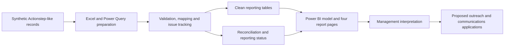

# Community Services Data Quality & DEX Reporting Simulation

**Using service data to support clear reporting, outreach planning and CRM adoption.**

This portfolio case study explores how a fictional Australian community services organisation can turn client, case, service, referral and assessment records into reliable management information. It combines Excel and Power Query data preparation with Power BI reporting, and illustrates how those findings could inform communications and service planning.

> **Simulation only.** The dataset is synthetic. This is not work commissioned by a legal service, an AIIM implementation, or a real funding submission. The original scenario uses Actionstep-like source structures and Northern Territory outlet labels; it does not represent WLSSA, its clients or South Australian service demand.

## At a Glance

| Area | Scope |
|---|---|
| Reporting period | 1 July 2024 – 30 June 2026 |
| Data scope | 800 synthetic client records, 1,100 cases and 1,350 referrals |
| Service records | 5,065 raw activities reduced to 5,000 clean service-session records |
| Quality controls | 694 logged issues; 3,820 sessions classified as reporting ready |
| Reporting | Four Power BI pages covering services, client profiles, referrals and outcomes |
| Tools | Excel, Power Query, Power BI and DAX |
| Public materials | Case-study narrative and embedded screenshots in this README |

**How to review this project:** start with the dashboard gallery and sample briefing below. The technical approach and metric definitions follow. The underlying workbooks, model and scripts are not currently published in this repository, so this page is a case-study showcase rather than a downloadable, reproducible project package.

## Relevance to Marketing and CRM Work

Service organisations need accurate information both to improve access and to explain their work. This project offers a foundation for the following tasks:

| Responsibility | Evidence in the existing project | Application illustrated in this README |
|---|---|---|
| Prepare management and funder reports | Service, referral and assessment views; reporting-readiness checks | A concise briefing that separates activity, process measures and outcomes |
| Inform community outreach | Client profiles, service pathways and delivery-method analysis | Questions and proposed actions to investigate access barriers |
| Support CRM data quality | Field mapping, validation rules, issue ownership and reconciliation | A proposed staff guidance and issue-resolution workflow |
| Communicate responsibly | Aggregated views and documented sensitivity considerations | Examples of internal versus public reporting |
| Explain findings to non-technical readers | Dashboard summaries and metric definitions | Plain-English interpretation with explicit limitations |

The outreach, communications and CRM adoption examples below are **proposed applications of the analysis**, not evidence of campaigns delivered, staff trained or a system deployed.

## Dashboard Gallery

### 1. Executive Overview

Summarises service-session volume, clients linked to services, cases, completion rate, monthly patterns, programs, outlets and delivery methods.

The published simulation reports 5,000 clean service-session records. Legal Assistance and Advice accounts for 1,701 records, while the fictional Darwin Regional Hub accounts for 1,715. Face-to-face delivery represents 41.5% of records.

These figures describe recorded activity. They do not establish population coverage, unmet need or the effect of marketing.

### 2. Service Delivery

Compares recorded session outcomes, service settings, delivery methods, duration and weekday patterns. These views can help a service team discuss capacity before increasing promotion or referrals.

### 3. Client and Case Profile

Shows presenting needs, assessed risk, age and gender distribution, and service pathways. These are internal planning views; a public version would require a separate disclosure review.

A smaller group in the dataset is a prompt for investigation, not proof that the community has less need or is underserved.

### 4. Referrals and Outcomes

Shows referral status, referred service types and simulated SCORE values by domain and assessment stage. Of 1,350 referrals, 751 are recorded as completed: 55.6%.

Referral completion is a process measure. Average assessment scores alone do not establish improvement or demonstrate that services caused a change.

## Sample Management and Funder Briefing

*Illustrative wording based on the synthetic project figures; not an actual funding report.*

During the two-year simulation, the dataset contained 5,000 clean service-session records and 1,350 referrals. Of those referrals, 751 were recorded as completed. Face-to-face delivery represented 41.5% of service-session records, highlighting the importance of considering in-person access alongside other delivery options.

Reporting checks classified 3,820 sessions as ready for reporting under the simulation's rules. Other records were non-reportable, awaiting confirmation or excluded. These categories should be explained separately: a non-reportable service is not automatically a data error or an unsuccessful service.

Three follow-up priorities emerge from the example:

1. Review outstanding referrals with service teams, including their age and status, before drawing conclusions about barriers.
2. Address late entry and missing assessment follow-up through clearer recording guidance and assigned issue owners.
3. Examine access patterns alongside community feedback, service capacity and relevant population or needs evidence before selecting an outreach priority.

This briefing describes activity and recording quality. It does not claim improved legal outcomes, campaign effectiveness or compliance with a particular funding agreement.

## From Findings to Outreach Planning

The following is a **planning framework**, not an implemented campaign or an additional dashboard.

| Existing signal | Question to investigate | Proposed action | How to evaluate |
|---|---|---|---|
| Differences between client groups or pathways | Do these patterns reflect eligibility, need, access barriers or recording gaps? | Consult service staff and relevant community representatives before selecting a priority audience | Agreed evidence of barriers and subsequent changes in appropriate enquiries |
| Referrals recorded as open or accepted | Are referrals recent, awaiting support, incorrectly recorded or encountering barriers? | Review referral age and reasons; clarify follow-up responsibilities with partner services | Status completeness and completion within a defined follow-up period |
| Substantial face-to-face activity | Which communication channels and formats help people access support safely? | Test accessible service information through appropriate community partners | Feedback on clarity and access; appropriate enquiries relative to capacity |
| Late data entry | Does the reporting cycle omit recent activity? | Provide a short recording guide and reminders before reporting deadlines | Entry timeliness and unresolved recording issues |

**Additional evidence needed:** inbound referral source, language or accessibility needs, suitable geographic groupings and community or population benchmarks are not demonstrated as outreach measures in the published gallery. They would need to be verified or added transparently as synthetic extensions.

Outreach evaluation should distinguish awareness, enquiries, eligible referrals and services accessed. The current dataset does not include campaign exposure or marketing spend, so it cannot establish campaign conversion, attribution or return on investment.

### Example of Plain-English Communications

*Fictional portfolio wording; not public advice or approved organisational copy.*

“Clear information and coordinated referrals can help people understand the support available to them. In this simulation, the reporting team reviews referral follow-up and service access patterns to identify questions for staff and community partners. Further consultation is needed before changing outreach priorities.”

A real service announcement would also need verified eligibility information, an approved and safe contact method, accessible formats and appropriate review. A client story would require a separate consent and confidentiality process; no client story is inferred from these records.

## CRM Adoption Support: Proposed Approach

The existing field mapping and issue register provide a starting point for staff guidance. A practical rollout support package could include:

| Material | Proposed content |
|---|---|
| One-page recording guide | Required fields, category definitions, date rules and examples of common errors |
| Staff FAQ | Why fields matter, what to do when information is unknown, and where to obtain help |
| Issue feedback process | Record the affected field and issue, assign an owner, track resolution and communicate updates through an approved internal channel |
| Rollout checklist | Confirm responsibilities, test common workflows, check report totals and gather staff feedback |
| Adoption review | Monitor recording timeliness, missing fields and recurring support questions |

These materials have not been delivered to a real organisation as part of this project.

**Transferability to AIIM:** field definitions, mapping, quality checks, reconciliation and user guidance are transferable concepts. This project does not use AIIM exports, validate an AIIM schema or demonstrate AIIM configuration. Any future implementation would need the actual system specifications and the organisation's reporting requirements. DEX requirements should not be assumed to apply to a prospective employer.

## Privacy, Cultural Safety and Responsible Communication

The project uses synthetic records. The following examples illustrate a proposed reporting approach, not a certification of legal compliance or proof that production access controls have been implemented.

| Information | Internal use, subject to appropriate access | Public-facing treatment |
|---|---|---|
| Client and case identifiers | Used where necessary for validation and follow-up | Omitted |
| Detailed risk and presenting-need information | Limited to authorised operational purposes | Excluded or carefully aggregated following review |
| Small demographic groups | Reviewed for identification and interpretation risks | Combined, suppressed or omitted where necessary; check that totals do not reveal hidden values |
| Protected addresses or locations | Handled only through authorised systems | Never included |
| Service totals and referral measures | Shown with definitions and recording limitations | Released only with a clear period, denominator and approved explanation |

A real reporting process would require an agreed disclosure approach, role-based access, appropriate retention arrangements and review by responsible staff. Removing names alone is not a sufficient reporting safeguard.

Communication should use respectful language, avoid blame and sensational detail, and preserve people's choice about sharing their experiences. Cultural safety requires engagement with relevant communities, including Aboriginal and Torres Strait Islander stakeholders where appropriate; it cannot be established by a dashboard or wording checklist alone.

## Data Preparation and Quality Controls

The documented workflow preserves source records separately from reporting tables:

1. Standardise identifiers, dates, categories and status values.
2. Identify duplicate clients and service activities.
3. Check required fields, category lists and record relationships.
4. Map programs and approved administrative outlets.
5. Validate service, referral and assessment date sequences.
6. Check SCORE values and follow-up completeness.
7. Assign reporting dispositions and log issues with owners.
8. Reconcile raw activities with clean and reporting-ready records.

### Results Recorded in the Simulation

| Check | Reported result |
|---|---:|
| Duplicate raw activities removed | 65 |
| Logged quality issues | 694 |
| Issue statuses | 482 resolved; 118 in review; 59 open; 35 accepted as risk |
| Reporting-ready sessions | 3,820 / 5,000 — 76.4% |
| Non-reportable sessions | 1,039 |
| Pending confirmation | 122 |
| Excluded sessions | 19 |
| Unexplained reconciliation variance | 0 |

Issue counts and session counts use different units. One session can have more than one issue. Zero unexplained reconciliation variance means the accounting of records balances within the simulation; it does not prove that all data is correct or that a real submission would be accepted.

### Quality Register

### Field Mapping

The documented mapping includes source and target fields, transformation and validation rules, mandatory-field status, sensitivity and business ownership.

### Reconciliation

The reconciliation separates duplicates, clean records and reporting dispositions. “Reporting ready” describes the simulated classification, not an actual submission.

## Technical Approach and Metric Definitions

The documented model comprises three fact tables and seven dimensions, with 13 relationships and 19 DAX measures.

- **Facts:** Service Session, Referral and SCORE.
- **Dimensions:** Client, Case, Date, Program Activity, Outlet, Staff and Reporting Period.
- **Preparation:** Excel and Power Query.
- **Analysis and presentation:** Power BI and DAX.

| Metric | Definition and interpretation |
|---|---|
| Client records | 800 synthetic clients in the dataset; not all necessarily linked to recorded services |
| Clients served | Distinct clients linked to service-session records in the selected context; the published overview displays 597 |
| Service sessions | 5,000 clean session records; includes different session outcomes and should not be described as 5,000 successfully completed services |
| Cases | 1,100 case records in the dataset; distinguish this from cases linked to sessions and rounded dashboard labels |
| Session completion rate | Completed sessions divided by total sessions in the selected context; separate from referral completion and reporting readiness |
| Referral completion rate | 751 completed referrals / 1,350 referrals = 55.6% for the stated simulation scope; not a measure of legal success |
| Reporting readiness | 3,820 reporting-ready sessions / 5,000 clean sessions = 76.4%, under the project's simulated rules |
| Average SCORE | Mean simulated assessment value in the current context; not a matched measure of change |

For a future outcome-change analysis, match the same client's assessments within the same domain and appropriate period, report the paired sample size and missing follow-up, and explain selection limitations. Separate averages across assessment stages should not be presented as evidence of individual improvement or causal impact.

## Project Contribution and Evidence

This portfolio involved AI-assisted preparation and production. The case study presents the workflow, reporting outputs and interpretation; it does not imply that every script, formula or visual was independently authored without assistance.

The public evidence currently consists of this narrative and the embedded screenshots. These support discussion of data quality, reporting choices and communication, but do not allow a reviewer to inspect calculations or refresh the model.

## Limitations and Next Steps

- All findings concern synthetic data, not actual clients, communities or service performance.
- The source structures are Actionstep-like simulations, not operational system extracts.
- DEX concepts are used for learning; the project is not a validated, upload-ready submission.
- Existing outlet labels belong to the original fictional scenario. No South Australian coverage or unmet-need claim is made.
- Outreach plans, communication examples and CRM adoption materials described here are illustrative extensions, not deployed activities.
- The project does not demonstrate actual marketing budget management, campaign results, staff training or AIIM implementation.
- Workbook formulas, model relationships, measures and refresh behaviour cannot currently be independently verified from this repository.

**Planned improvements:** publish an appropriately reviewed synthetic data and model package; provide higher-resolution dashboard exports; validate matched outcome measures; and develop standalone outreach, reporting and staff-guidance samples. These are future additions, not files currently available for download.

