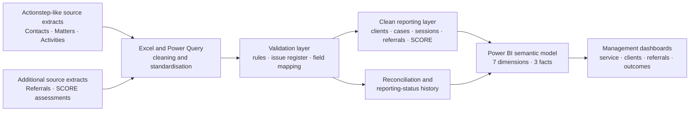

# Community Services Data Quality & DEX Reporting Simulation

An end-to-end portfolio project demonstrating how a fictional Australian community services organisation could transform Actionstep-like operational extracts into governed, DEX-aligned reporting data and Power BI management insights.


## Project Overview

Community services organisations often need to combine client, case, service, referral and outcome information from operational systems while meeting funding, audit, privacy and reporting requirements.

This project simulates that workflow from source data to management reporting. It demonstrates:

- Excel-based data cleaning and visible formula checks;
- Power Query transformation and standardisation;
- DEX-aligned client, case, session, outlet, referral and SCORE structures;
- data quality identification, ownership and resolution tracking;
- source-to-report reconciliation and audit history;
- Power BI data modelling and DAX measures; and
- decision-focused dashboards for program managers and service teams.

## Business Questions

The project was designed to answer five practical questions:

1. How much service was delivered, and how did demand change over time?
2. Which program activities, outlets, service settings and delivery methods carried the greatest workload?
3. Which presenting needs, risk levels, age groups and service pathways characterised the client and case profile?
4. What happened to referrals, and how did simulated SCORE results vary by domain and assessment stage?
5. Which records were ready for reporting, which required review, and could every source-to-report variance be explained?

## Project Scope

| Item | Volume or scope |
|---|---:|
| Reporting period | 1 July 2024 – 30 June 2026 |
| Synthetic clients | 800 |
| Cases | 1,100 |
| Raw service activities | 5,065 |
| Clean service sessions | 5,000 |
| Referrals | 1,350 |
| SCORE assessments | 1,800 |
| Staff records | 48 |
| Approved outlets | 5 |
| Program activities | 5 |
| Logged data quality issues | 694 |
| Reporting-ready sessions | 3,820 |
| Unexplained reconciliation variance | 0 |

## Tools and Skills

| Area | Tools and techniques |
|---|---|
| Data preparation | Microsoft Excel, formulas, lookup and logical checks, Power Query |
| Data quality | duplicate detection, missing-value review, category standardisation, date validation, key matching and referential-integrity checks |
| Reporting concepts | DEX-aligned records, reporting dispositions, outlet controls, SCORE assessments and reconciliation |
| Data modelling | Power BI semantic model, 10 tables, 13 relationships and star-schema principles |
| Analysis | 19 DAX measures, filtering, segmentation, trend analysis and outcome reporting |
| Communication | executive summaries, operational dashboards, data dictionary, field mapping and audit documentation |

## Data Architecture



### Data layers

**Source layer**

- Raw Contacts
- Raw Matters
- Raw Activities
- Raw Referrals
- Raw Assessments

**Clean reporting layer**

- Clients
- Cases
- Service Sessions
- Referrals
- SCORE Assessments

**Reference layer**

- Program Activities
- Outlets
- Staff
- Reporting Periods

**Quality, audit and documentation layer**

- Data Quality Issues
- Validation Rules
- Field Mapping
- Data Dictionary
- Reconciliation
- Reporting Status History

## Data Cleaning and Quality Controls

The cleaning workflow preserved the original source exports and created separate reporting-ready tables. The major steps were:

1. Standardise identifiers, dates, text categories and status values.
2. Detect duplicate client and service-activity records.
3. Check mandatory fields and approved category lists.
4. Validate client-to-case and case-to-session relationships.
5. Map program activities and approved administrative outlets.
6. Validate case, service, referral and assessment dates.
7. Check SCORE completeness and valid value ranges.
8. Assign each service session a reporting disposition.
9. Log issues with severity, ownership, resolution status and preventive action.
10. Reconcile source activities to clean, non-reportable, excluded, pending and reporting-ready records.

### Example validation controls

| Control | Purpose |
|---|---|
| Unique source and session identifiers | Prevent double counting |
| Valid client and case keys | Prevent orphan records |
| Approved program mapping | Support consistent program reporting |
| Approved outlet mapping | Avoid client or protected addresses being used as service outlets |
| Date sequencing | Ensure close dates, service dates and assessment dates are logically valid |
| Mandatory-field checks | Identify incomplete reportable records |
| SCORE range and follow-up checks | Support meaningful outcome reporting |
| Entry-delay monitoring | Identify late data entry before reporting deadlines |

### Data quality results

- **65** duplicate raw service activities were identified before creation of the clean session table.
- **694** quality issues were logged: 482 resolved, 118 in review, 59 open and 35 accepted as risk.
- **3,820 sessions (76.4%)** were classified as reporting ready.
- **1,039 sessions (20.8%)** were non-reportable, 122 required confirmation and 19 were excluded.
- All reconciliation groups returned **zero unexplained variance**.
- Late data entry was the largest issue category, followed by missing SCORE follow-up and reporting-status mismatches.


### Source-to-report mapping

The mapping register documents the source field, target field, transformation rule, validation rule, mandatory-field status, sensitivity and business owner.


### Reconciliation

The reconciliation layer explains the difference between raw source activities and submitted/reporting-ready records through duplicate, non-reportable, excluded and pending-confirmation counts.


## Power BI Data Model

The semantic model contains three fact tables and seven dimensions connected through 13 many-to-one relationships.

**Fact tables**

- `Fact_ServiceSession`
- `Fact_Referral`
- `Fact_SCORE`

**Dimension tables**

- `Dim_Client`
- `Dim_Case`
- `Dim_Date`
- `Dim_ProgramActivity`
- `Dim_Outlet`
- `Dim_Staff`
- `Dim_ReportingPeriod`

The model includes 19 DAX measures covering service sessions, clients served, cases supported, service hours, completion rates, referrals, referral completion, warm referrals and SCORE results.

### Selected measure definitions

| Measure | Definition |
|---|---|
| Service Sessions | Count of clean service-session rows |
| Clients Served | Distinct clients linked to service sessions |
| Cases Supported | Distinct cases linked to service sessions |
| Completion Rate | Completed service sessions divided by total service sessions |
| Referral Completion Rate | Completed referrals divided by total referrals |
| Average SCORE | Mean simulated SCORE value in the current filter context |

## Dashboard Gallery

### 1. Executive Overview

Provides a management summary of service volume, client reach, cases supported, completion rate, monthly trends, program activity, outlet workload and delivery methods.

Full-period findings illustrated by the simulation include:

- 5,000 service sessions were delivered across the two-year period.
- Legal Assistance and Advice was the largest program activity with 1,701 sessions.
- Darwin Regional Hub recorded the highest volume with 1,715 sessions.
- Face-to-face delivery represented 41.5% of sessions.
- Monthly service volume was highest in May–June 2026.


### 2. Service Delivery

Examines monthly session outcomes, service settings, average duration by delivery method and weekday demand. The page supports workload planning and comparison of office, community, remote and virtual delivery.


### 3. Client & Case Profile

Analyses presenting needs, assessed risk, age and gender distribution, and service pathways. A summary table shows priority or urgent cases, open cases and total cases by pathway.


### 4. Referrals & Outcomes

Tracks referral trends, referral status and referred service types, together with average SCORE results by domain and assessment stage. In the simulated data, 751 of 1,350 referrals were completed, representing a completion rate of 55.6%.


## Illustrative Management Actions

Because the data is synthetic, the following are examples of how an organisation could translate the analysis into action rather than recommendations for any real service provider:

- plan staffing and service capacity around high-volume reporting periods;
- review resource allocation across high-volume programs and outlets;
- maintain blended delivery while protecting face-to-face and outreach capacity;
- strengthen referral follow-up for accepted and open referrals;
- provide practical staff support and validation prompts to reduce late data entry;
- monitor SCORE follow-up completeness before reporting deadlines; and
- review high, critical and not-assessed cases with program teams using culturally safe and privacy-conscious processes.

## Privacy and Culturally Safe Reporting

The project uses synthetic identifiers and aggregated dashboard outputs. A production implementation would also require organisational governance and consultation with program teams and Aboriginal and Torres Strait Islander stakeholders.

The simulated controls demonstrate the following principles:

- do not publish names, street addresses or protected service locations;
- do not use a client's home or refuge address as an outlet;
- flag sensitive fields in the data dictionary and mapping register;
- avoid inferring identity or demographic information when it is not stated;
- consider suppression or aggregation for small client groups;
- restrict access according to role and operational need; and
- explain metric definitions, exclusions and limitations to report users.

## Repository Contents

### Key project files

- [Main Excel data package](outputs/community_services_dex_reporting_simulation_20260717/Community_Services_Data_Quality_and_DEX_Reporting_Simulation.xlsx)
- [Formula-driven data cleaning workbook](outputs/formula_cleaned_workbook_20260717/raw_data_formula_cleaned_with_visible_formulas.xlsx)
- [Power BI-ready Excel dataset](outputs/powerbi_ready_20260718/DEXData_PowerBI_Ready.xlsx)
- [Power BI project](outputs/powerbi_ready_20260718/Community_Services_DEX_Model/Community_Services_DEX_Model.pbip)
- [Quality assurance summary](outputs/community_services_dex_reporting_simulation_20260717/QA_Summary.json)
- [CSV data exports](outputs/community_services_dex_reporting_simulation_20260717/csv/)

```text
Community_Services_DEX_Data_Project/
├── README.md
├── docs/
│   └── images/                         # Dashboard and workbook screenshots
├── outputs/
│   ├── community_services_dex_reporting_simulation_20260717/
│   │   ├── Community_Services_Data_Quality_and_DEX_Reporting_Simulation.xlsx
│   │   ├── QA_Summary.json
│   │   └── csv/                        # Source, clean, reference and audit exports
│   ├── formula_cleaned_workbook_20260717/
│   │   └── raw_data_formula_cleaned_with_visible_formulas.xlsx
│   └── powerbi_ready_20260718/
│       ├── DEXData_PowerBI_Ready.xlsx
│       └── Community_Services_DEX_Model/
│           └── Community_Services_DEX_Model.pbip
└── scripts/                             # Reproducible data and PBIP build utilities
```

## Open the Project

1. Download or clone this repository.
2. Review the main Excel data package and the formula-driven cleaning workbook.
3. Open `Community_Services_DEX_Model.pbip` in Power BI Desktop.
4. If required, update the Power BI data-source path to the downloaded copy of `DEXData_PowerBI_Ready.xlsx`.
5. Refresh the model and explore the four report pages using the financial-year, program and outlet filters.

## Limitations

- The dataset is synthetic and does not describe any real organisation, client or community.
- The source tables are Actionstep-like simulations and were not extracted from an operational Actionstep environment.
- The structure is DEX-aligned for portfolio learning but is not a validated or upload-ready DEX submission.
- Findings are descriptive and should not be interpreted as evidence of causal relationships.
- Production use would require current program-specific DEX specifications, funding-agreement requirements, security controls, governance approval and consultation with service teams and communities.

## Portfolio Purpose

This project was created to demonstrate practical capability in community-services data collection, Excel and Power Query cleaning, information management, DEX-aligned reporting, Power BI modelling, dashboard development, reconciliation, audit support and clear communication of technical information to non-technical users.

